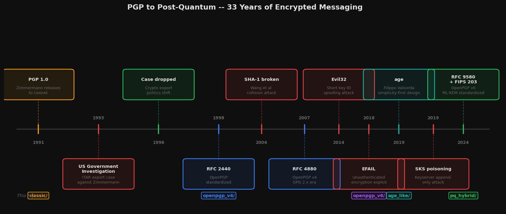
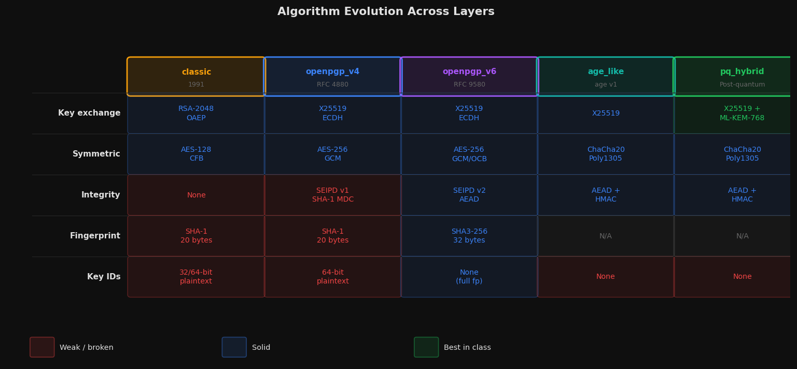
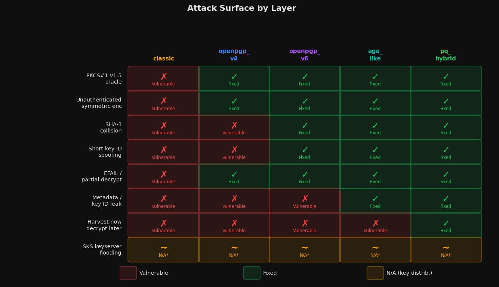
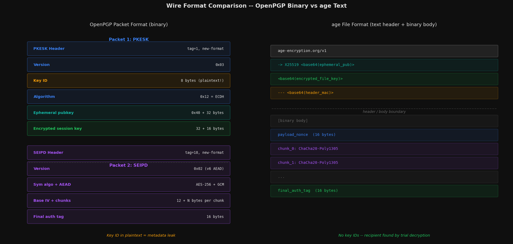

# pgp-evolution

A layered implementation of encrypted messaging from PGP's 1991 origins to
post-quantum hybrid encryption. Each layer is a working Python implementation
that demonstrates what changed, why, and what the tradeoffs are.

This is not a wrapper around GPG. The packet formats, handshakes, and key
derivation are written from scratch. The `cryptography` library is used only
for primitives (AES, ChaCha20, X25519, Ed25519, HKDF, etc.).

Read [HISTORY.md](HISTORY.md) first. It tells the story behind each layer.

---

## Evolution timeline



---

## Layers

| Directory | Standard | Key Exchange | Symmetric | Integrity |
|---|---|---|---|---|
| `classic/` | PGP 1991-era | RSA-2048-OAEP | AES-128-CFB | None (demonstrates the weakness) |
| `openpgp_v4/` | RFC 4880 | X25519 ECDH | AES-256-GCM | SEIPD v1 + MDC |
| `openpgp_v6/` | RFC 9580 (2024) | X25519 ECDH | AES-256-GCM | SEIPD v2 mandatory AEAD |
| `age_like/` | age v1 | X25519 | ChaCha20-Poly1305 | AEAD + header MAC |
| `pq_hybrid/` | age v1 extended | X25519 + ML-KEM-768 | ChaCha20-Poly1305 | AEAD + header MAC |

### Algorithm evolution at a glance



---

## Setup

```
pip install -e ".[dev]"
```

The post-quantum layer additionally requires liboqs and pyoqs:

```
pip install pyoqs
```

liboqs must be installed on your system. See the Open Quantum Safe project
at https://openquantumsafe.org for installation instructions.

---

## Running tests

```
pytest
```

The `pq_hybrid` tests are skipped automatically if pyoqs is not installed.

---

## Usage

Each layer has a CLI entry point installed by `pip install -e .`.

### Classic (RSA-2048 + AES-128-CFB)

```
pgp-classic keygen --out mykey
pgp-classic encrypt --pub mykey.pub.pem --in message.txt --out message.asc
pgp-classic decrypt --priv mykey.priv.pem --in message.asc
```

### OpenPGP v4 (Ed25519 + X25519 + AES-256-GCM)

```
pgp-v4 keygen > mykey.json
pgp-v4 encrypt --key-json mykey.json --in message.txt --out message.asc
pgp-v4 decrypt --key-json mykey.json --in message.asc
```

### OpenPGP v6 (RFC 9580, SEIPD v2 AEAD)

```
pgp-v6 keygen > mykey.json
pgp-v6 encrypt --key-json mykey.json --in message.txt --out message.asc
pgp-v6 decrypt --key-json mykey.json --in message.asc
```

### age-like (X25519 + ChaCha20-Poly1305)

```
age-enc keygen > identity.txt
age-enc encrypt -r age1... --in message.txt --out message.age
age-enc decrypt -i identity.txt --in message.age
```

### Post-quantum hybrid (X25519 + ML-KEM-768 + ChaCha20-Poly1305)

```
pq-enc keygen > keys.json
pq-enc encrypt --key-json pub.json --in message.txt --out message.pqage
pq-enc decrypt --key-json priv.json --in message.pqage
```

---

## Attack surface by layer

Which attacks each layer is vulnerable to versus protected against:



---

## Wire format comparison

OpenPGP binary packet layout versus age text stanza, side by side:



> The hybrid KEM key derivation diagram (X25519 + ML-KEM-768 combining into a
> single shared secret) is best rendered as a designed figure -- see
> [docs/layer-reference.md](docs/layer-reference.md) for the written walkthrough.

---

## Design notes

### What this is not

This is not a drop-in GPG replacement. It is a study in protocol design.
Several deliberate simplifications are made:

- Key management (keyservers, key signing, revocation) is not implemented.
  Those systems are interesting failures worth studying separately.
- The classic layer's lack of integrity protection is intentional. It is there
  to demonstrate the attack surface, not to be used.
- AES-256-OCB is approximated with AES-256-GCM in the v6 layer because Python's
  cryptography library does not expose OCB directly. A production implementation
  would use cffi bindings to OpenSSL's EVP_OCB.

### Why these five layers

The progression from classic to pq_hybrid traces the actual history of the field:
1. RSA + no integrity = the original problem
2. ECDH + MDC = modern GPG, mostly correct
3. Mandatory AEAD = what the standard should have required from the start
4. Throw out the complexity = age's answer to the complexity argument
5. Hybrid PQ KEM = the answer to the quantum threat, deployed today by Cloudflare

Each layer makes one or two key improvements over the previous one. Reading them
in order is more instructive than reading a single correct implementation.

---

## References

- RFC 4880 -- OpenPGP Message Format
- RFC 9580 -- OpenPGP (2024)
- FIPS 203 -- ML-KEM (Module-Lattice Key Encapsulation Mechanism)
- age file format v1: https://age-encryption.org/v1
- Open Quantum Safe project: https://openquantumsafe.org
- "The PGP Problem" -- Latacora (2019)
